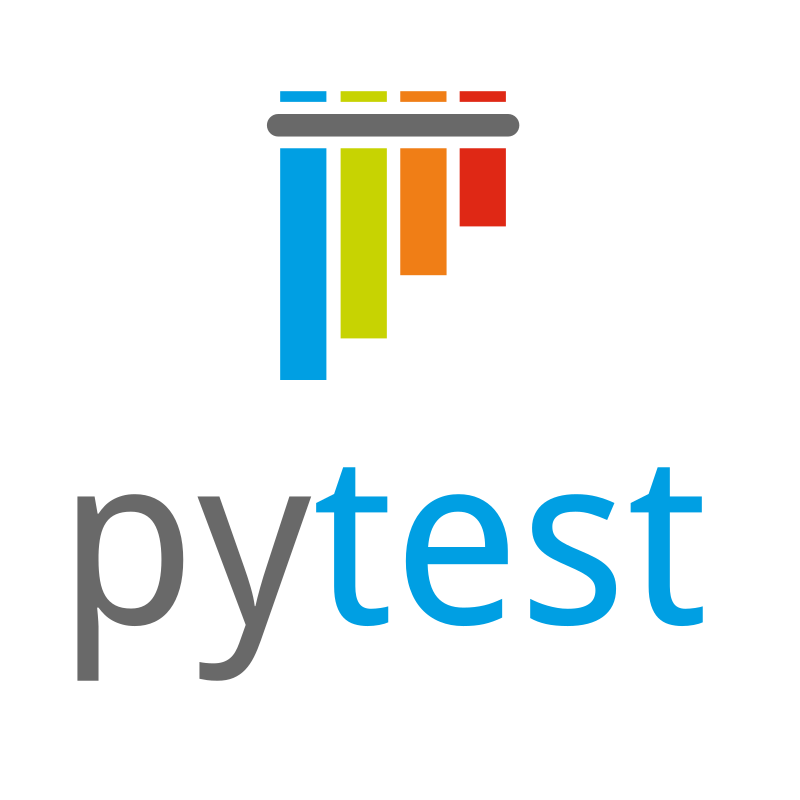
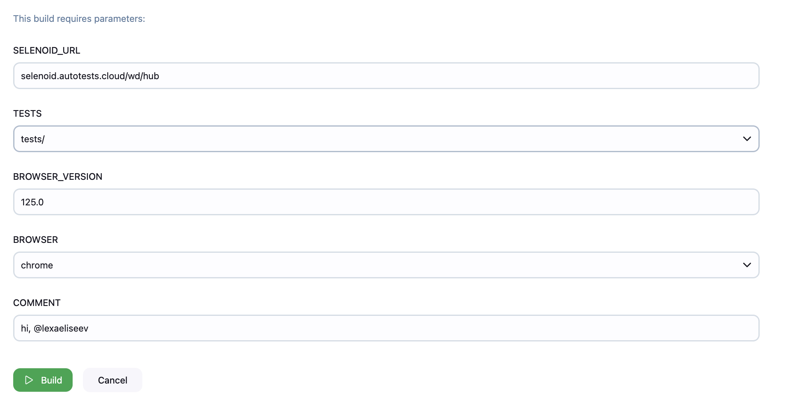
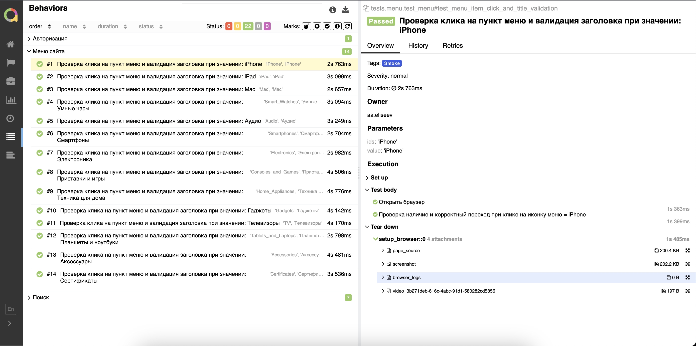
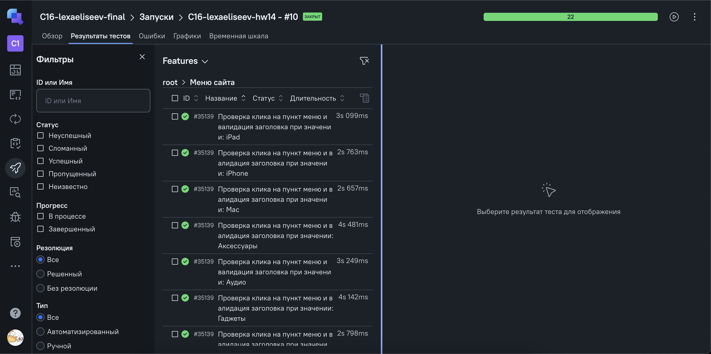
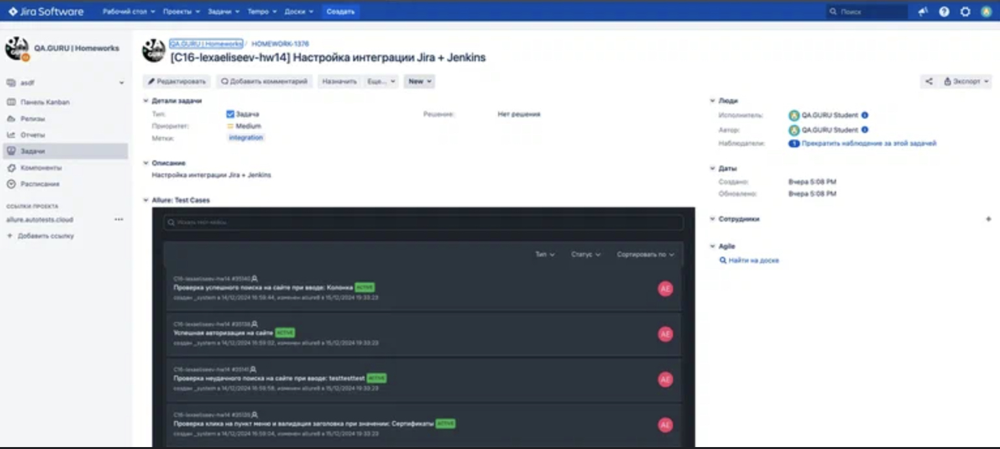
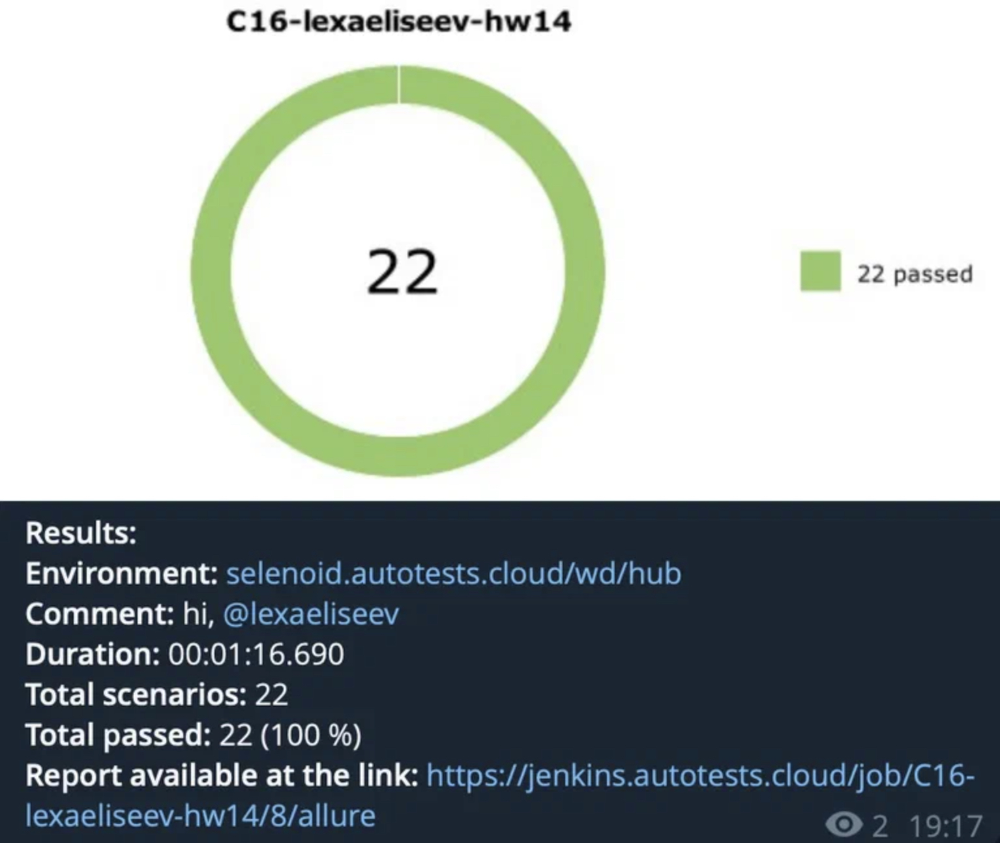

 <h1 align="center">Автоматизация интернет-магазина <a href="https://pitergsm.ru/">PiterGsm</a></h1>

### Используемый стек технологий и инструментов



### Реализованные UI автотесты
- Проверка успешной авторизации в системе
- Проверка отображения пунктов меню и конкретного перехода к нужному разделу при клике на них
- Проверка успешного поиска товара
- Проверка отображения ошибки при не успешном поиске товара
---

### Запуск автотестов

### 💻 Локальный запуск

1. **Склонируйте репозиторий:**
   ```sh
   git clone <git@github.com:lexaeliseev/pitergsm-ui-autotests.git>
   
2. **Установите зависимости:**
   ```
   python -m venv .venv
   source .venv/bin/activate
   pip install -r requirements.txt
---

3. **Создайте файл .env по образцу в папке проекта:**
   ```python
   URL = "https://pitergsm.ru"
   
   STEPIK_EMAIL = ''
   STEPIK_PASSWORD = ''
   
   SELENOID_URL = 'selenoid.autotests.cloud/wd/hub'
   SELENOID_LOGIN = ''
   SELENOID_PASSWORD = ''
   
   CLIENT_ID = ''
   CLIENT_SECRET = ''
   ```
   
4. **Запустите тесты в PyCharm или в командной строке:**
   ```
   pytest . --browser=[firefox|chrome]
   # Укажите браузер: chrome (по умолчанию) или firefox
   ```
---
5. **Запуск автотестов на удаленном сервере**
```
python -m venv .venv
source .venv/bin/activate
pip install -r requirements.txt
pytest . --run_mode=remote --browser=[chrome|firefox] --browser_version=125.0
# Укажите браузер: chrome (по умолчанию) или firefox, и версию браузера (по умолчанию 125.0)
```
---
### Сборка в <a href="https://jenkins.autotests.cloud/job/C16-lexaeliseev-hw14/">Jenkins</a>
Для запуска сборки выполните следующие шаги:
1. Перейдите в раздел **"Build with Parameters"**.
2. Укажите необходимые параметры:
   - **Адрес удаленного сервера**: Введите URL-адрес удаленного сервера.
   - **Выбор набора тестов**: Укажите, какие тесты должны быть запущены.
   - **Версия браузера**: Выберите версию браузера для тестирования.
   - **Браузер**: Укажите, какой браузер использовать (Chrome или Firefox).
   - **Комментарий для оповещения в Telegram**: Добавьте комментарий, который будет отправлен в Telegram для оповещения о статусе тестов.
3. После заполнения всех параметров нажмите кнопку **"Build"**.


---
### Реализована интеграция с Allure
#### Allure отчетность



**При выполнении автотестов к результатам тестов прикрепляются артефакты, например логи, скриншоты и т.д.**


#### Allure TestOps


##### При выполнении автотестов к результатам тестов прикрепляются логи, скриншоты, HTML-страница и видеозапись прохождения кейса.

##### Пример видео
https://github.com/user-attachments/assets/f6e853d1-3e50-47b6-a308-6dc586ce366d

### Реализована интеграция с Jira


---
### Внедрена функция отправки уведомлений в Telegram о результатах выполнения тестов

